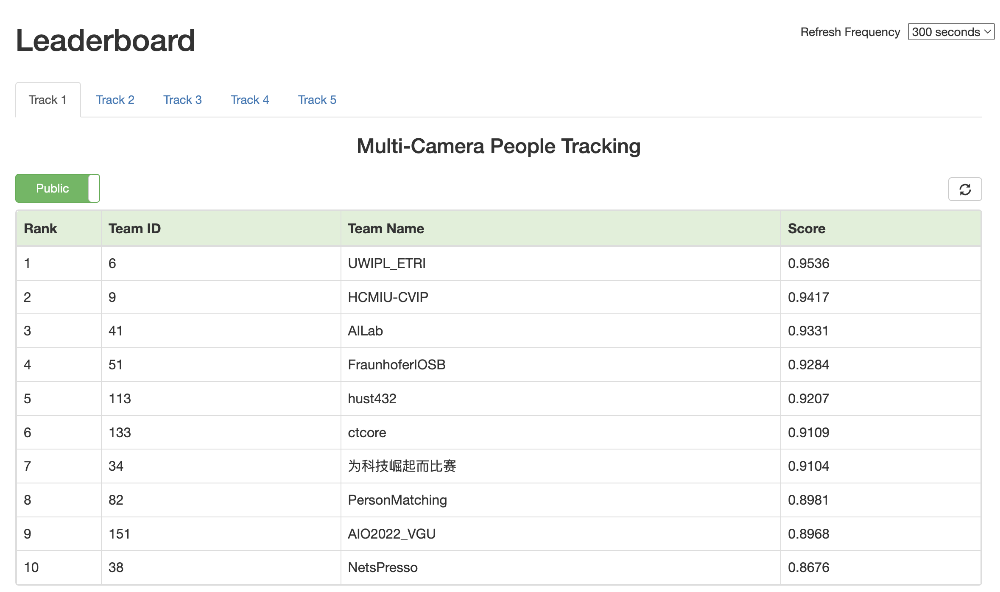
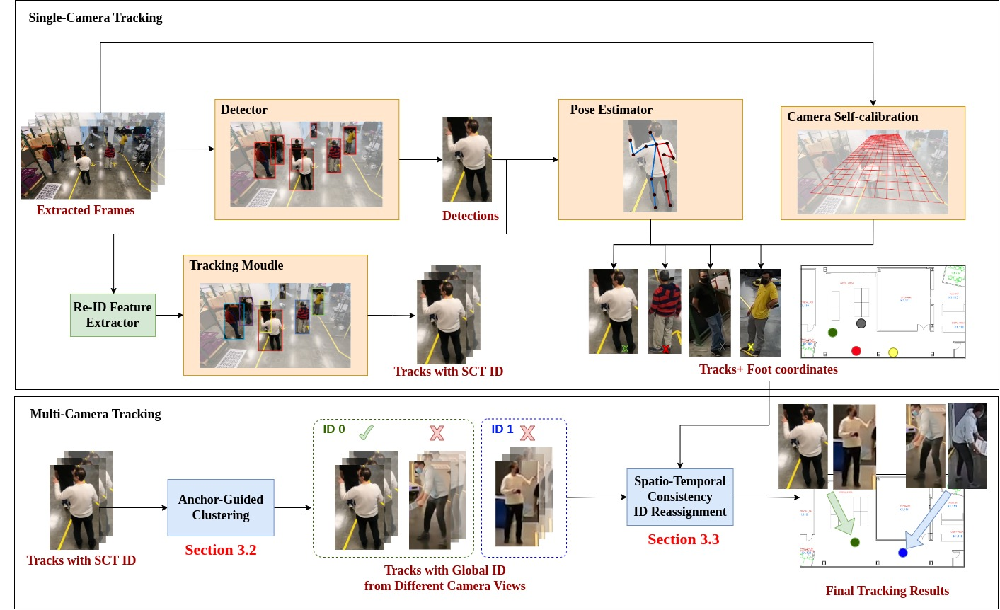

# CVPRW2023: Enhancing Multi-Camera People Tracking with Anchor-Guided Clustering and Spatio-Temporal Consistency ID Re-Assignment

This is the official repositroy for 7th NVIDIA AI City Challenge (2023) Track 1: Multi-Camera People Tracking. [[Arxiv]](https://arxiv.org/abs/2304.09471)
 
## Ranking 



## Overall Pipeline



## Enviroment Requirements

The implementation of our work is built upon [BoT-SORT](https://github.com/NirAharon/BoT-SORT), [OpenMMLab](https://github.com/open-mmlab), and [torchreid](https://github.com/KaiyangZhou/deep-person-reid). We also adapt [Cal_PnP](https://github.com/zhengthomastang/Cal_PnP) for camera self-calibration.

Four different enviroments are required for the reproduce process. Please install these three enviroments according to the following repos:
1. [Installation for mmyolo*](https://github.com/open-mmlab/mmyolo#%EF%B8%8F-installation-)
2. [Installation for mmpose](https://mmpose.readthedocs.io/en/latest/installation.html)
3. [Installation for torchreid*](https://github.com/KaiyangZhou/deep-person-reid#installation)
4. [Installation for BoT-SORT](https://github.com/NirAharon/BoT-SORT#installation)

\* optional for fast reproduce

## Training 

#### Train Synthetic Detector (skip for fast reproduce)
0. Prepare MTMC Dataset and annotations
Download `AIC23_Track1_MTMC_Tracking.zip` from [AICity organizer](https://www.aicitychallenge.org/2023-data-and-evaluation/) and unzip under the root directory of this repo and run:
```
bash scripts/0_prepare_mtmc_data.sh
```

You should see the `data` folder organized as follows: 
```
data
├── annotations
│   ├── fine_tune
│   │   ├── train_hospital_val_hospital_sr_20_0_img_15197.json
│   │   ├── train_market_val_market_sr_20_0_img_19965.json
│   │   ├── train_office_val_office_sr_20_0_img_20696.json
│   │   └── train_storage_val_storage_sr_20_0_img_15846.json
│   └── train_all_val_all_sr_20_10_img_77154.json
├── train
│   ├── S002
│   │   ├── c008
│   │   │   ├── frame
│   │   │   ├── label.txt
│   │   │   └── video.mp4
│   .   .
│   .   .
├── validation
└── train
```

1. Train yolov7 models on synthetic data
```
bash scripts/1_train_detector.sh
```

\* Note that the configs we provided are the ones we used in our submission. They may not be optimized for your GPU, please adjust the batchsize accordingly.

#### Train Synthetic ReID Model (skip for fast reproduce)
0. Prepare ReID Dataset
```
mkdir deep-person-reid/reid-data
```
Download our [sampled dataset](https://drive.google.com/file/d/1ry8IhXgCGgkP9ZlkOyfyLKstorVcr3N1/view?usp=sharing) and unzip it under [deep-person-reid/reid-data](deep-person-reid/reid-data).

\* Note that the file name DukeMTMC is just for training convenience, the DukeMTMC dataset is not used in our training process.

1. Train reid model on synthetic data
```
bash 2_train_reid.sh
```

[//]: # (After the training is finished, move the model to `deep-person-reid/checkpoints` and modify the model name to `synthetic_reid_model_60_epoch.pth`.)

## Inferencing

#### Get Detection (skip for fast reproduce)
0. To Fast Reproduce

Directly use the txt files in the `data/test_det` folder and skip the following steps.

1. Prepare Models

- Download the pretrained YOLOX_x from [ByteTrack [Google Drive]](https://drive.google.com/file/d/1P4mY0Yyd3PPTybgZkjMYhFri88nTmJX5/view)
- Download (or train from scratch) the YOLOv7 weights from [[Google Drive]](https://drive.google.com/drive/folders/10LT1BlBAfYnr-fJjka_Lnzf4nH0N723-?usp=share_link)

2. Get Real (S001) detection
```
bash scripts/3_inference_det_real.sh
```

3. Get Synthetic detection
```
bash scripts/4_inference_det_syn.sh
```

#### Get Embedding 
0. To Fast Reproduce
Download the [embedding npy files](https://drive.google.com/drive/folders/1qbwu37PlFSxmJIBLzJq1L9cAwryahAj7) and put all the npy files under `data/test_emb`, then you can skip step 1 and 2.

1. Prepare Models (optional)
* Download the [ReID model](https://drive.google.com/file/d/1cP-3esZSnktw64SXMHn5cDk6BX15e2-q/view?usp=sharing) for synthetic dataset
* Download the pretrained ReID models from [torchreid](https://kaiyangzhou.github.io/deep-person-reid/MODEL_ZOO). Including [osnet_ms_m_c](https://drive.google.com/file/d/1UxUI4NsE108UCvcy3O1Ufe73nIVPKCiu/view), [osnet_ibn_ms_m_c](https://drive.google.com/file/d/1Sk-2SSwKAF8n1Z4p_Lm_pl0E6v2WlIBn/view), [osnet_ain_ms_m_c](https://drive.google.com/file/d/1YjJ1ZprCmaKG6MH2P9nScB9FL_Utf9t1/view), [osnet_x1_0_market](https://drive.google.com/file/d/1vduhq5DpN2q1g4fYEZfPI17MJeh9qyrA/view), [osnet_x1_0_msmt17](https://drive.google.com/file/d/112EMUfBPYeYg70w-syK6V6Mx8-Qb9Q1M/view)
* Put all the models in deep-person-reid/checkpoints

2. Get Appearance Embedding (optional)
```
bash scripts/5_inference_emb.sh
```

### Run Tracking

The root_path for the following command should set to the repo's loaction

1. Navigate to the BoT-SORT folder
```
cd BoT-SORT
```

2. Run tracking
```
conda activate botsort_env
python tools/run_tracking.py <root_path>
```

3. Generate foot keypoint (optional)
```
conda activate mmpose
cd ../mmpose
python demo/top_down_video_demo_with_track_file.py <tracking_file.txt> \ 
       configs/body/2d_kpt_sview_rgb_img/topdown_heatmap/coco/hrnet_w48_coco_256x192.py \
       https://download.openmmlab.com/mmpose/top_down/hrnet/hrnet_w48_coco_256x192-b9e0b3ab_20200708.pth \
       --video-path <video_file.mp4> \
       --out-file <out_keypoint.json>
python tools/convert.py
```

4. Conduct spatio-temporal consistency reassignment 
```
python STCRA/run_stcra.py <input_tracking_file_folder> <output_tracking_file_folder>
```

5. Generate final submission
```
cd ../BoT-SORT
python tools/aic_interpolation.py <root_path>
python tools/boundaryrect_removal.py <root_path>
python tools/generate_submission.py <root_path>
```
